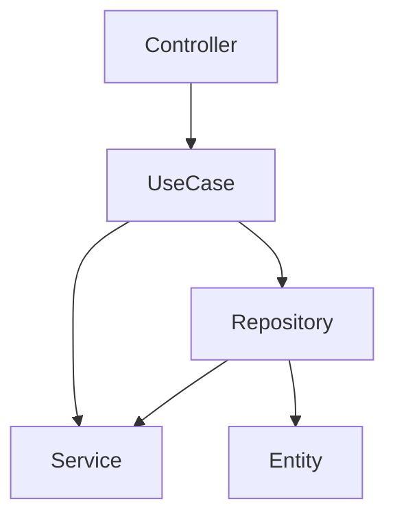

# Implements Clean Architecture with PHP

[](https://packagist.org/packages/giacomomasseron/php-clean-architecture)
[](https://github.com/giacomomasseron/php-clean-architecture/actions?query=workflow%3Arun-tests+branch%3Amain)
[](https://github.com/giacomomasseron/php-clean-architecture/actions?query=workflow%3A"Fix+PHP+code+style+issues"+branch%3Amain)
[](https://packagist.org/packages/giacomomasseron/php-clean-architecture)

Implements Clean Architecture as described by Robert C. Martin (Uncle Bob) here  
[Clean Architecture](https://blog.cleancoder.com/uncle-bob/2012/08/13/the-clean-architecture.html).

This is an opinionated package that defines levels of the architecture and the dependencies between them.

- [Installation](#installation)
- [Why Clean Code](##Why-Clean-Code)
- [Concepts](##Concepts)
    - [UseCase](###Use-Case)
    - [Architecture Level](###Architecture-Level)
- [How it works](##How-it-works)
    - [Define a level inside the project](###Define-a-level-inside-the-project)


## Installation

You can install the package via composer:

```bash
composer require giacomomasseron/php-clean-architecture
```

After the installation, you must run the install command to publish the deptrac file to your root folder:
```bash
vendor/bin/php-clean-architecture install
```


## Why Clean Code?

Why not?  
It is a well-known, well structured architecture system.

## Concepts

### UseCase

A UseCase is every action your project does.  
A good example of use cases are:
- Login
- Register
- CompleteOrder

### Architecture Level

In the Clean Code architecture, a level is a level (no way!) of the architecture with specific function, **only connected to the upper level**.

## How it works

The package uses [deptrac](https://github.com/deptrac/deptrac) to define the levels and to check the dependencies betweeh them.  
These are the levels defined:

- Entity
- Repository
- UseCase
- Controller
- Service

These are the dependencies between the levels:



The *Entity* level must not depends on any other level.  
The *Repository* level can only depends on *Entity* or *Service* levels.  
The *UseLevel* level can only depends on *Repository* or *Service* levels.  
The *Controller* level can only depends on *UseCase* levels.

### Define a level inside the project

The package comes with these interfaces:

- **EntityInterface**: implements this interface if the class belongs to Entity level.
- **RepositoryInterface**: implements this interface this interface if the class belongs to Repository level.
- **UseCaseInterface**: implements this interface if the class belongs to UseCase level.
- **ControllerInterface**: implements this interface if the class belongs to Controller level.

For example, in a Laravel project, you want your controller being a part of Controller level:

```php
public class YourController extends Controller implements GiacomoMasseroni\PHPCleanArchitecture\Contracts\ControllerInterface
```

## Testing

```bash
composer test
```

## Changelog

Please see [CHANGELOG](CHANGELOG.md) for more information on what has changed recently.

## Contributing

Please see [CONTRIBUTING](CONTRIBUTING.md) for details.

## Security Vulnerabilities

Please review [our security policy](../../security/policy) on how to report security vulnerabilities.

## Credits

- [Giacomo Masseroni](https://github.com/giacomomasseron)
- [All Contributors](../../contributors)

## License

The MIT License (MIT). Please see [License File](LICENSE.md) for more information.
