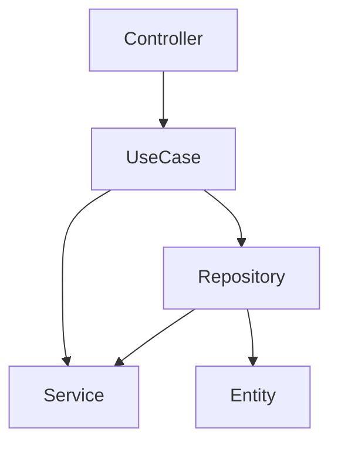

# Implements Clean Architecture with PHP

[](https://packagist.org/packages/giacomomasseron/php-clean-architecture)
[](https://github.com/giacomomasseron/php-clean-architecture/actions?query=workflow%3Arun-tests+branch%3Amain)
[](https://github.com/giacomomasseron/php-clean-architecture/actions?query=workflow%3A"Fix+PHP+code+style+issues"+branch%3Amain)
[](https://packagist.org/packages/giacomomasseron/php-clean-architecture)

Implements Clean Architecture as described by Robert C. Martin (Uncle Bob) here:    
[Clean Architecture](https://blog.cleancoder.com/uncle-bob/2012/08/13/the-clean-architecture.html)

This is an opinionated package that defines levels of the architecture and the dependencies between them.

- [Installation](#installation)
- [Getting started](#Getting-started)
- [Why Clean Code](#Why-Clean-Code)
- [Concepts](#Concepts)
    - [Architecture Level](#Architecture-Level)
    - [UseCase](#UseCase)
- [How it works](#How-it-works)
    - [Levels](#Levels)
    - [Define a level inside the project](#Define-a-level-inside-the-project)
    - [UseCases](#UseCases)
- [CI/CD](#CICD)


## Installation

You can install the package via composer:

```bash
composer require giacomomasseron/php-clean-architecture
```

After the installation, you must run the *install* command to publish *deptrac.yaml* file to your root folder:
```bash
vendor/bin/php-clean-architecture install
```

## Getting started

To check the architecture levels in your project, use the following command:

```bash
vendor/bin/php-clean-architecture check
```

## Why Clean Code?

Why not?  
It is a well-known, well-structured architecture system.

## Concepts

### Architecture Level

In the Clean Architecture, a level is a layer of the architecture with a specific function, **only connected to the upper level**.

The rule of thumb of the Clean Architecture is:  
**An inner circle must never know anything about the circles around it**.


### UseCase

UseCase is a concept of Use Cases level.  

An UseCase is every action your project performs.  
Good examples of use cases are:
- Login
- Register
- CompleteOrder
- UpdateProfile

**A use case should be a single, very specific action. It shouldn’t do anything more than its name suggests.**

## How it works

The package uses [deptrac](https://github.com/deptrac/deptrac) to define the levels and to check the dependencies between them.  

### Levels

These are the levels defined:

- Entity
- Repository
- UseCase
- Controller
- Service

These are the dependencies between the levels:



The *Entity* level must not depend on any other level.  
The *Repository* level can only depend on *Entity* or *Service* levels.  
The *UseCase* level can only depend on *Repository* or *Service* levels.  
The *Controller* level can only depend on *UseCase* levels.

**What is Service level?**  
The Service level can be used for third part tools or libraries.

### Define a level inside the project

The package comes with these interfaces:

- **EntityInterface**: implements this interface if the class belongs to Entity level.
- **RepositoryInterface**: implements this interface if the class belongs to Repository level.
- **UseCaseInterface**: implements this interface if the class belongs to UseCase level.
- **ControllerInterface**: implements this interface if the class belongs to Controller level.

For classes that belong to the Service level, you need the class name must contains the *Service* word.  
For example:  

```php
final public class ThirdPartyService
```


If you want your controller to be part of the Controller level, you need to implement the ControllerInterface.  
For example:

```php
use GiacomoMasseroni\PHPCleanArchitecture\Contracts\ControllerInterface;

public class YourController implements ControllerInterface
```

### UseCases

When you create a UseCase, you need the class extends the BaseUseCase class, and you need to implement the UseCaseInterface.  
For example:

```php
use GiacomoMasseroni\PHPCleanArchitecture\BaseUseCase;
use GiacomoMasseroni\PHPCleanArchitecture\Contracts\UseCaseInterface;

public class DoSomething extends BaseUseCase implements UseCaseInterface
{
    public function handle(...$arguments): mixed
    {
        //
    }
}
```

To execute the UseCase, you need to call the *run* method defined in the BaseUseCase class:

```php
DoSomething::run($arg1, $arg2);
```


## CI/CD

If you want to check the architecture levels in your CI/CD pipeline, you can use the following command:

```bash
vendor/bin/php-clean-architecture check
```

This command will stop your pipeline if there are architecture violations, based on the deptrac configuration file.

## Testing

```bash
composer test
```

## Changelog

Please see [CHANGELOG](CHANGELOG.md) for more information on what has changed recently.

## Contributing

Please see [CONTRIBUTING](CONTRIBUTING.md) for details.

## Security Vulnerabilities

Please review [our security policy](../../security/policy) on how to report security vulnerabilities.

## Credits

- [Giacomo Masseroni](https://github.com/giacomomasseron)
- [All Contributors](../../contributors)

## License

The MIT License (MIT). Please see [License File](LICENSE.md) for more information.
